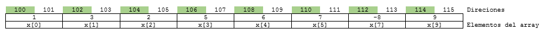

# Laboratorio de vectores y apuntadores

> **Objetivos**
> * Introducir el concepto de apuntador, su uso e importancia en la realizacion de programas en C.
> * Comprender la relación que se establece entre apuntadores, variables y memoria.
> * Entender el uso de vectores en C.
> * Relacionar y aplicar los conceptos: vectores, apuntadores y funciones para el desarrollo de problemas de programacion.

## 1. Resumen y repaso

Revisar la parte teorica la cual se encuentra en el siguiente [enlace](https://github.com/repos-SO-UdeA/laboratorios/blob/master/lab1/teoria/parte2/ptr_arrays.ipynb)

## 2. Ejemplos de repaso

### 2.1. Apuntadores y variables

1. Despues de que se simula el siguiente [codigo](https://goo.gl/QXBsL8), ¿Cual es el valor final de la variable ch?

```C
#include <stdio.h>

int main() {
  char *p1, *p2;
  char ch = 'a';
  printf("ch = %c\n", ch);
  p1 = &ch;
  (*p1)++;
  printf("ch = %c\n", ch);
  p2 = p1;
  *p2 += 3;
  printf("ch = %c\n", ch);
  return 0;
}
```

2. Suponga que se simula el siguiente [codigo](https://goo.gl/5NeAxm)

```C
#include <stdio.h>

int main() {
  int *p1, *p2;
  int a = 3;
  p1 = &a;
  p2 = p1;
  printf("------------------\n");
  printf("a = %d\n", a);
  printf("p1 = %p\n", p1);
  printf("p2 = %p\n",p2);  
  (*p1)++;
  *p2++;
  printf("------------------\n");
  printf("a = %d\n", a);
  printf("p1 = %p\n", p1);
  printf("p2 = %p\n",p2);
  return 0;
}
```

Por que se muestran los valores mostrados a la salida en pantalla. Puede ser util que revise el siguiente [enlace](http://en.cppreference.com/w/c/language/operator_precedence)

### 2.2. Apuntadores y vectores

1. ¿Que es lo que hace el siguiente [codigo](https://goo.gl/ybji6p)?

```C
#include <stdio.h>

int main() {
  int V[4] = {1,2,3,4};
  int VS[4];
  int s;   
  for(int i = 0; i < 4; i++) {    
    s = 0;
    for(int j = 0; j <= i; j++) {
      s += V[j];
    }
    VS[3 - i] = s;
  }
  return 0;
}
```

2. ¿Que es lo que hace el siguiente [codigo](https://goo.gl/jnaR9z)?

```C
#include <stdio.h>

int main() {
  int V[4] = {1,2,3,4};
  int VS[4];
  int s;   
  for(int i = 0; i < 4; i++) {    
    s = 0;
    for(int j = 0; j <= i; j++) {
      s += *(V + j);
    }
    *((VS + 3) - i) = s;
  }
  return 0;
}
```

3. ¿Que es lo que hace el siguiente [codigo](https://goo.gl/Ao4mjH)?

```C
#include <stdio.h>

int main() {
  int *p1, *p2;
  int V[4] = {1,2,3,4};
  int VS[4];
  int s;  
  p2 = &VS[3];  
  for(int i = 0; i <4; i++) {
    p1 = V;
    s = 0;
    for(int j = 0; j <= i; j++) {
      s += *p1;
      p1++;
    }
    *p2 = s;
    p2--;
  }
  return 0;
}
```

### 2.3. Funciones por referencia y por valor

1. Dado el siguiente prototipo para la funcion **incremento**:

```C
/* Funcion que aumenta el valor de la variable pasada como argumento */
void incremento(int v);
```

A continuacion se muestra la implementacion y un ejemplo de uso de la funcion:

```C
#include <stdio.h>

void incremento(int);

int main() {
  int v = 3;
  int *p = &v;
  printf("Antes de la funcion \'incremento\' v vale %d\n",v);
  incremento(v);
  printf("Despues de la funcion \'incremento\' v vale %d\n",v);
  incremento(*p); // Pregunta
  printf("Despues de la funcion \'incremento\' otra vez v vale %d\n",v);
  return 0;
}

void incremento(int i) {
  i++;
}
```

Simule el programa anterior usando el siguiente [enlace](https://goo.gl/NmWCAc) y responda las siguientes preguntas:
* ¿El valor de v cambia?, ¿Por que?
* ¿Por que en la linea cuyo comentario es Pregunta se usa el asterisco (*) al invocar la funcion?

2. Dado el siguiente prototipo para la funcion **incremento**:

```C
/* Funcion que aumenta el valor de la variable pasada como argumento */
void incremento(int *v);
```

A continuacion se muestra la implementacion y un ejemplo de uso de la funcion:

```C
#include <stdio.h>

void incremento(int*);

int main() {
  int v = 3;
  int *p = &v;
  printf("Antes de la funcion \'incremento\' v vale %d\n",v);
  incremento(&v);   // Pregunta 2
  printf("Despues de la funcion \'incremento\' v vale %d\n",v);
  incremento(p);   // Pregunta 3
  printf("Despues de la funcion \'incremento\' otra vez v vale %d\n",v);
  return 0;
}

void incremento(int *i) {
  *i += 1;
}
```

Simule el programa anterior usando el siguiente [enlace](https://goo.gl/aTyRft) y responda las siguientes preguntas:
* ¿El valor de v cambia?, ¿Por que?
* ¿Por que en la linea cuyo comentario es **Pregunta 2** se usa el ampersand (&) al invocar la funcion?
* ¿Por que en la linea cuyo comentario es **Pregunta 3** no se usa el ampersand (&) al invocar la funcion?, ¿Que pasa si se usa el ampersand?

4. Dado el siguiente codigo:

```C
#include <stdio.h>

int foo(int a, int *b);

int main() {
  int x = 3, y = 4, z = 0;
  printf("x = %d, y = %d, z = %d\n", x, y, z);
  z = foo(x, &y);
  printf("x = %d, y = %d, z = %d\n", x, y, z);  
}

int foo(int a, int *b) {
  int r;
  a++;
  *b += a;
  r = a + *b;
}
```
Simule el [código anterior](https://goo.gl/vBaqbt) y deduzca por que los valores de **x**, **y** y **z** son los que se muestran antes y despues del llamado de la funcion.

### 2.4. Funciones y vectores

1. Hacer una funcion que lea una cadena de caracteres y permita obtener el numero de vocales y consonantes. La forma de la funcion es la siguiente:

```C

 /**  
  *   @brief  Determina la cantidad de vocales y consonantes en una cadena de caracteres
  *  
  *   @param  s es una cadena de caracteres
  *   @param  nv es el parametro al cual se llevara el numero de vocales
  *   @param  nc es el parametro al cual se llevara el numero de consonantes
  *   @return void
  */
  void contarCaracteres(char *s, int nv, int nc) {
    // Coloque su codigo aqui
    ...
  }
```

**Solucion**:

```C

/**  
 *   @brief  Determina si un caracter es vocal
 *  
 *   @param  ch es el caracter a verificar
 *   @return 1 si el caracter es vocal y 0 si es consonante
 */
int esVocal(char ch) {
  if ((ch >= 'a' && ch <= 'z') || (ch >= 'A' && ch <= 'Z')) {
    if (ch == 'a' || ch == 'e' || ch == 'i' || ch == 'o' || ch == 'u' || \
        ch == 'A' || ch == 'E' || ch == 'I' || ch == 'O' || ch == 'U' ) {
      return 1;
    }   
    else {
      return 0;
    }
  }
  else {
    return -1;
  }
}

/**  
 *   @brief  Determina la cantidad de vocales y consonantes en una cadena de caracteres
 *  
 *   @param  s es una cadena de caracteres
 *   @param  nv es el parametro al cual se llevara el numero de vocales
 *   @param  nc es el parametro al cual se llevara el numero de consonantes
 *   @return void
 */

void contarCaracteres(char *s, int *nv, int *nc) {
  *nv = 0;
  *nc = 0;
   while(*s != '\0') {
       if(esVocal(*s) == 1) {
         *nv += 1;
       } else if(esVocal(*s) == 0) {
         *nc += 1;
       }
     s++;
   }
}
```

2. Una vez hecho lo anterior, realizar una funcion que permita probar las funciones anteriores con la cadena **"tengo 5 ovejas"**.

**Solucion**: La funcion de test se muestra a continuación:

```C
void test(char *c) {
  printf("Cadena: %s\n",c);  
  int numVoc, numCons;
  contarCaracteres(c, &numVoc, &numCons);
  printf("Numero de vocales: %d\n", numVoc);
  printf("Numero de consonantes: %d\n", numCons);
}
```
En el siguiente [enlace](https://goo.gl/dfZSpr) se muestra la simulacion del codigo, cuya salida para el caso es:

```
Cadena: Tengo 5 ovejas
Numero de vocales: 5
Numero de consonantes: 6
```

3. Hacer una funcion para revertir el contenido de un array, la funcion tendrá la siguiente forma:

```C

 /**  
  *   @brief  Revierte el contenido de un array de enteros
  *  
  *   @param  in es el arreglo de entrada
  *   @param  out es el arreglo de salida
  *   @param  n es el tamaño del los arrays
  *   @return void
  */
  void contarCaracteres(int *in, int *out, int n) {
    // Coloque su codigo aqui
    ...
  }
```

La solucion de la funcion anterior se muestra a continuacion:

```C

/**  
 *   @brief  Revierte el contenido de un array de enteros
 *  
 *   @param  in es el arreglo de entrada
 *   @param  out es el arreglo de salida
 *   @param  n es el tamaño del los arrays
 *   @return void
 */
void contarCaracteres(int *in, int *out, int n) {
  out = out + (n - 1);
  for (int i = 0; i < n; i++) {
    *out-- = *in++;
  }
}
```

En el siguiente [codigo](https://goo.gl/gY3RDg), se simula la funcion anteriormente definida:


## 3. Ejercicios conceptuales

**Ejercicio 1**:

Suponga que se tiene el siguiente vector con las siguientes direcciones:


**Figura 1**. Vector inicial ejercicio 1

Adicionalemente, suponga que se declararon 3 apuntadores **p1**, **p2** y **p3** los cuales se encuentran en la direcciones **1000**, **2000** y **3000** respectivamente. Dadas las siguientes instrucciones:

```C
int *p1, *p2;
p1 = x;
p2 = &X[9];
*p2 = (*p2)*(-1)-(-1);
*p1 = 2*(*(p2-1))+*(p2-2);
p1++; // p1 = p1 + 1;
int *p3 = X + 3;
*p3 = *p3 + 1;
p2 = p3 + 2;
```

1. Dibuje el mapa de memoria asociado al problema anterior.
2  Despues de que se ejecuta el codigo anterior: Actualice el vector con los nuevos valores después de la ejecución del código anteriormente mostrado (**Nota**: no olvide resaltar el lugar apundado por los apuntadores):


**Figura 2**. Contenido del vector del ejercicio 1 despues de la ejecucion del codigo (Llenar).

Adicionalmente, llene el mapa de memoria con los nuevos valores tanto de los elementos del vector como de los apuntadores despues de la ejecucion del codigo.

3. Llene la siguiente tabla después de que se llevó a cabo la ejecución del código:

| Expresión  | Valor |
| ------------- | ------------- |
| &p1  |   |
| &p2  |   |
| &p3  |   |
| p1  |   |
| p2  |   |
| p3  |   |
| *p1  |   |
| *p2  |   |
| *p1  |   |
| *p1 + 1  |   |
| *(p1 + 1)  |   |
| p3 + 1  |   |
| p3 - 2  |   |

**Ejercicio 2**:
El proposito del siguiente codigo es que usted refuerce el concepto de llamadas por valor y por referencia. Observe el siguiente codigo:

```C
int f(int x, int y, int *z);

int main() {
  int a, b, c, d;
  int *p1, *p2 = &a, *p3 = &d;
  a = 2;
  b = -1;
  p2 = &c;  
  d = f(a + 3, b, &c);
  p1 = p2;
  // Parada 1...
  *p3 = f(*p2, -d, p1);
  // Parada 2...
  return 0;
}

int f(int x, int y, int *z) {
  *z = x + y;
  x++;  
  return *z + x + y;
}
```

Ahora responda las siguientes preguntas:

1. Llene la siguiente tabla con el contenido de las variables hasta que se llega al punto de parada 1 (Ver comentario en el codigo):


| Expresión  | Valor |
| ------------- | ------------- |
| a  |   |
| b  |   |
| c  |   |
| d  |   |
| *p1  |   |
| *p2  |   |
| *p3 |   |
| p1  |   |
| p2  |   |
| p3  |   |

2. Ahora llene la siguiente tabla con el contenido de las variables hasta que se llega al punto de parada 2 (Ver comentario en el codigo):

| Expresión  | Valor |
| ------------- | ------------- |
| a  |   |
| b  |   |
| c  |   |
| d  |   |
| *p1  |   |
| *p2  |   |
| *p3 |   |
| p1  |   |
| p2  |   |
| p3  |   |

## 4. Problemas de programacion resueltos

1. Escriba una funcion que retorne el producto de un array teniendo en cuenta la siguiente forma:

```C
/**  
 *   @brief  Calcula el producto de los elementos de un array
 *  
 *   @param  array es el arreglo a pasar
 *   @param  size es el tamaño del arreglo pasado como argumento
 *   @return el producto de los elementos del vector
 */

 int product(const int *array, int size){
    // Coloque su codigo aqui
    ...
  }
```

Luego realice una función que permita verificar el correcto funcionamiento de funcion anteriormente codificada.

**Solucion**: La solución del problema anterior se muestra a continuacion:

```C
#include <stdio.h>

void test(void);
int product(const int *array, int size);

int main() {
  test();
  return 0;
}

/**  
 *   @brief  Calcula el producto de los elementos de un array
 *  
 *   @param  array es el arreglo a pasar
 *   @param  size es el tamaño del arreglo pasado como argumento
 *   @return el producto de los elementos del vector
 */
int product(const int *array, int size) {
  int p = *array;
  int i;
  for (i = 1; i < size; i++) {
    p = p*(*++array);
  }  
  return p;
}

void test(void) {
  int V[] = {1,2,3,4,5};
  int p = product(V,5);
  printf("Resp = %d\n",p);  
}
```

El programa puede ser simulado en el siguiente [enlace](https://goo.gl/JhEdHv) y la salida arrojada por este es:

```
Resp = 120
```

2. Empleando la funcion anteriormente codificada escriba un programa que permita que un usuario ingrese un vector de 3 elementos para luego calcular su producto. El programa se debera ejecutar cuantas veces el usuario lo desee:

**Solucion**: El codigo solución de muestra a continuacion:

```C
/**
* Compilation:
* gcc -Wall code_4_2.c -o code_4_2.out
*/

#include <stdio.h>

void inputVector(int *);
int product(const int *, int);

int main(void) {
    int vIn[3];
    int prod;
    char seguir;
    do {
        printf("Ingrese el vector de 3 elementos: ");
        inputVector(vIn);
        prod = product(vIn,3);
        printf("El producto es: %d\n\n",prod);
        fflush(stdin);
        printf("Desea continuar (y/n)? ");
        scanf("%c",&seguir);
        printf("\n");
    } while(seguir == 'y');
    printf("Suerte es que le digo\n");
    return 0;
}

/**
 *   @brief  Permite ingresar cada uno de los componentes de un vector de 3 elementod
 *
 *   @param  array es el arreglo que se va a ingresar
 *   @return void
 */
void inputVector(int *array) {
    int i;
    for(i = 0;i < 3;i++) {
        scanf("%d",(array + i));
    }
}

/**
 *   @brief  Calcula el producto de los elementos de un array
 *
 *   @param  array es el arreglo a pasar
 *   @param  size es el tamaño del arreglo pasado como argumento
 *   @return el producto de los elementos del vector
 */
int product(const int *array, int size) {
  int p = *array;
  int i;
  for (i = 1; i < size; i++) {
    p = p*(*++array);
  }
  return p;
}
```
El codigo solucion se encuetra en el codigo: [code_4_2.c](code_4_2.c)

3. Codifique una funcion que encuentre el valor minimo y maximo de un array siguiendo el formato mostrado a continuación:

```C
/**
 *   @brief  Obtiene los elementos maximo y minimo de un array.
 *
 *   @param  array es el arreglo a pasar
 *   @param  size es el tamaño del arreglo pasado como argumento
 *   @param  min es la variable a la cual se asignara el valor minimo (por refenrecia)
 *   @param  min es la variable a la cual se asignara el valor minimo (por refenrecia)
 *   @return no retorna nada
 */
void max_min(double *array, int size, double *min, double *max) {
  // Coloque aqui el codigo...
}
```

**Solucion**: La simulación online se muestra en el siguiente [enlace](https://goo.gl/cds8ac). A continuacion se reproduce el codigo alli presente:

```C
#include <stdio.h>

void max_min(double *array, int size, double *mini, double *maxi);
void test(void);
int main() {
  test();
  return 0;
}

/**
 *   @brief  Obtiene los elementos maximo y minimo de un array.
 *
 *   @param  array es el arreglo a pasar
 *   @param  size es el tamaño del arreglo pasado como argumento
 *   @param  min es la variable a la cual se asignara el valor minimo (por refenrecia)
 *   @param  min es la variable a la cual se asignara el valor minimo (por refenrecia)
 *   @return no retorna nada
 */
void max_min(double *array, int size, double *min, double *max) {
  *min = *array;
  *max = *array;
  for (int i = 1; i < size; i++) {
    if(*(array + i) >= *max) {
      *max = *(array + i);
    }
    if(*(array + i) <= *min) {
      *min = *(array + i);
    }
  }
}

void test(void) {
  double A[] = {-1.2, 2.4, -3.5, 10.2, 4};
  double m, M;
  max_min(A,5,&m,&M);
  printf("- Minimo: %lf\n",m);
  printf("- Maximo: %lf\n",M);
}
```
4. Supongase que cada 4 horas se esta midiendo el porcentaje de uso de una CPU. Haga un programa que permita saber cual es el procenjate de uso maximo y minimo durante el dia. Para ello emplee la función creada en el punto 3.

**Nota**: Se deja este ejercicio al estudiante

5. Suponga que usted hace parte de un equipo de desarrollo que esta trabajando en el juego del ahorcado. Hacer una funcion que se le solicite una cadena y un caracter, esto con el fin de reemplazar reemplazar todo aquel caracter de la cadena que sea igual al caracter  ingresado como argumento por una raya (-). La funcion debera devolver el numero de caracteres diferentes de raya.

```C
/**
 *   @brief  Reemplaza cada caracter de array igual a ch por un guion (-).
 *
 *   @param  array es el arreglo a pasar
 *   @param  ch es el caracter a averiguar
 *   @return numero de caracteres de array no descubiertos (No reemplazados por guion)
 */
int reemplazarCaracter(char *array, char ch) {
  // Coloque su codigo a continuacion...
}
```

**Solucion**: La solucion con test del problema anterior se muestra en el siguiente [enlace](https://goo.gl/A17q8i). Su codigo se muestra a continuacion:

```C
#include <stdio.h>

void test(void);
int reemplazarCaracter(char *, char);

int main() {
  test();
  return 0;
}

/**
 *   @brief  Reemplaza cada caracter de array igual a ch por un guion (-).
 *
 *   @param  array es el arreglo a pasar
 *   @param  ch es el caracter a averiguar
 *   @return numero de caracteres de array no descubiertos (No reemplazados por guion)
 */
int reemplazarCaracter(char *array, char ch) {
  int cnt = 0;
  while (*array != '\0') {
    if(ch == *array) {
      *array = '-';  
    }
    else if (*array != '-') {
      cnt++;
    }
    array++;
  }
  return cnt;
}

void test(void) {
  char cad[] = "cadena";
  int v = reemplazarCaracter(cad,'a');
  printf("%s : %d\n", cad, v);
  v = reemplazarCaracter(cad,'n');
  printf("%s : %d\n", cad, v);
}
```

## 5. Ejercicios de programación.

Para cada uno de los ejercicio de programacion propuestos a continuacion, realice la respectiva funcion de test para probar el correcto funcionamiento de lo que se pide en el ejercicio.

1. **Problema de programación**: Hacer que barra una cadena de caracteres en busca de un caracter especifico. La funcion deberá retornar el numero de veces que aparece este caracter o -1 en caso de que no este. La forma de la funcion se muestra a continuación:

```C
/**
 *   @brief  Cuenta las veces que aparece un caracter determinado dentro de una cadena.
 *
 *   @param  array cadena de caracteres a ingresar
 *   @param  ch es el caracter a averiguar
 *   @return el numero de veces que aparece ch en array o -1 si no aparece.
 */
int contarCaracter(char *array, char ch) {
  // Coloque su codigo aqui...
}
```

2. **Problema de programación**: Hacer una funcion que permita que un usuario obtenga el subindice asociado a la primera aparicion de un caracter en un array. Si el caracter no esta la función debera retornar -1. Haga uso de la funcion del punto 1 para validar la presencia del caracter. A continuacion se muestra la forma de la función:

```C
/**
 *   @brief  Obtiene el indice de la primera aparicion de un caracter en un array
 *
 *   @param  array cadena de caracteres a ingresar
 *   @param  ch es el caracter a ingresa
 *   @return el indice del primer ch en la cadena array
 */
int obtenerIndice(char *array, char ch) {
  // Coloque su codigo aqui...
}
```

Para clarificar un poco la cosa, si por ejemplo la cadena es **hola: que mas** y el caracter a buscar es **:** la funcion debera retornar **4**. Por otro lado, si el caracter a buscar es la **a**, la funcion retornara **3**. Finalmente, si el caracter ingresado es **z** la funcion retornara **-1**.

3. **Problema de programación**: Obtener la subcadena de una cadena dada a partir de un subindice siguiendo la siguiente funcion.

```C
/**
 *   @brief  Obtiene una subcadena a tomada a partir de un subindice asociado a una subcadena
 *
 *   @param  array cadena de caracteres a ingresar
 *   @param  index indice
 *   @return un apuntador a la posicion inicial de la subcadena o NULL si el tamaño de index supera a la longitud de la cadena
 */
char *obtenerSubcadena(char *array, int index) {
  // Coloque su codigo aqui...
}
```
Para averiguar la longitud de la cadena puede emplar la funcion **strlen** de la libreria **string.h**. Por ejemplo, para el caso, si la cadena es **hola que tal** y el indice ingresado por el usuario es **4**, la funcion debera retornar un apuntador que apunte a la posicion **5** de la cadena, de modo que cuando se imprima la cadena en cuestion a partir de este apuntado se muestre la siguiente salida **que tal**. En el siguiente ejemplo se aterriza lo anterior suponiendo que ya se codifico la funcion subcadena.

```C
char *p1 = "Hola que tal";
char *p2;
p2 = obtenerSubcadena(p1, 5);
printf("%s\n",p1);    // Imprime: Hola que tal
printf("%s\n",p2);    // Imprime: que tal
```

4. **Analisis de codigo**: Dado el siguiente codigo fuente tomado del siguiente [enlace](https://en.wikibooks.org/wiki/C_Programming/stdio.h/getchar)

```C
#include <stdio.h>

// Codigo tomado de: https://en.wikibooks.org/wiki/C_Programming/stdio.h/getchar

 int main(void)
 {
   char str[1000];
   int ch, n = 0;
   while ((ch = getchar()) != EOF && n < 1000) {
      str[n] = ch;
      ++n;
   }   
   for (int i = 0; i < n; ++i)
      putchar(str[i]);

   putchar('\n');
   return 0;
 }
```

Guardelo como punto1.c y compilelo como punto1.out:

```
gcc -Wall punto1.c -o punto1.out
```

Luego corralo:

```
./punto1.out
```

**Nota**: Cuando un programa en C corre infinitamente presione la combinacion ```Ctrl + D``` (que envia una notificación de EOF) o la combinacin ```Ctrl + C``` (que permite la terminación del programa que se esta ejecutando actualmente) para culminar su ejecución.

Responda las siguientes preguntas:
1. ¿Que hace el programa anterior?
2. Describa las funciones ```getchar``` y ```putchar```
3. ¿Cuales son las condiciones necesarias para que el primer ciclo deje de ejecutarse?

5. **Problema de programación**: Codifique un programa que permita convertir en mayuscula una cadena de caracteres ingresada por teclado y solo terminara su ejecución cuando el usuario emplee la combinación de teclas . Por ejemplo si la entrada del programa es:

```
1234abcdABCD!
```

La salida debera ser:

```
1234ABCDABCD!
```

La implementación del programa deberá ser hecha de manera modular, de modo que el objetivo realice las siguientes tareas de manera gradual tal y como se muestra a continuación:

* **Fase 1 - Codificando las funciones**: dado el siguiente código (c1_parte1.c) completelo complete las funciones es que complete la siguiente el inicialmente el siguiente codigo y lo compile. Si todo esta bien, puede continuar con la **fase 2**; sino, corrija los errores hasta que compile.

```C
#include <stdio.h>


/*********************************************************/
/*            Declaraciones de las funciones             */
/*********************************************************/

/* Funciones de test */
void testVolverMayuscula(void);
void testEsLetra(void);
void testStringToMayuscula(void);

/* Funciones del programa */
int esLetra(char ch);
void volverMayuscula(char *ch);
void stringToMayuscula(char s[]);


/*********************************************************/
/*                     Funcion main                      */
/*********************************************************/


int main(void) {
  testVolverMayuscula();
  testEsLetra();
  testStringToMayuscula();
  return 0;
}

/*********************************************************/
/*            Declaraciones de las funciones             */
/*********************************************************/

#include <stdio.h>

/* Funciones del programa */
int esLetra(char ch);
void volverMayuscula(char *ch);
void stringToMayuscula(char s[]);

/*********************************************************/
/*             Definiciones de las funciones             */
/*********************************************************/

/* Funciones del programa */

/**  
 *   @brief  Determina si un caracter alfabetico
 *  
 *   @param  ch es el caracter a verificar
 *   @return 1 si el caracter es una letra del alfabeto y 0 si es otro simbolo.
 */
int esLetra(char ch) {
  // Coloque el codigo solucion a continuacion...

}

/**  
 *   @brief  Convierte un caracter en mayuscula
 *  
 *   @param  ch es el caracter ingresado
 *   @return void
 */
void volverMayuscula(char *ch) {
  // Coloque el codigo solucion a continuacion...

}


/**  
 *   @brief  Convierte en mayusculas la cadena de caracteres ingresada.
 *  
 *   @param  s es una cadena de caracteres ingresada y la cual despues del proceso en la función tendra los caracteres en mayuscula.
 *   @return void
 */

void stringToMayuscula(char s[]) {
  // Coloque el codigo solucion a continuacion...

}
```

* **Fase 2 - Testeando las funciones**: Una vez las funciones estan codificadas, verifique que implementen correctamente la logica. Para ello agregue al codigo anterior las siguientes funciones de test, e invoquelas en el main como se muestra a continuacion:

```C
#include <stdio.h>


/*********************************************************/
/*            Declaraciones de las funciones             */
/*********************************************************/

/* Funciones de test */
void testVolverMayuscula(void);
void testEsLetra(void);
void testStringToMayuscula(void);

/* Funciones del programa */
int esLetra(char ch);
void volverMayuscula(char *ch);
void stringToMayuscula(char s[]);


/*********************************************************/
/*                     Funcion main                      */
/*********************************************************/


int main(void) {
  testVolverMayuscula();
  testEsLetra();
  testStringToMayuscula();
  return 0;
}

/*********************************************************/
/*             Definiciones de las funciones             */
/*********************************************************/

/* Funciones de test */

/**  
 *   @brief  Funcion para testear volverMayuscula
 *  
 *   @param  void
 *   @return void
 */
void testVolverMayuscula(void) {
  char *p_char;
  char l1 = 'a', l2 = 'z';
  p_char = &l2;
  printf("Minusculas -> %c, %c\n", l1, l2);
  volverMayuscula(&l1);
  volverMayuscula(p_char);
  printf("Mayusculas -> %c, %c\n", l1, *p_char);
}

/**  
 *   @brief  Funcion para testear esLetra
 *  
 *   @param  void
 *   @return void
 */
void testEsLetra(void) {
  char c1 = '!', c2 = 's';
  printf("%c -> %d\n", c1, esLetra(c1));
  printf("%c -> %d\n", c2, esLetra(c2));
}

void testStringToMayuscula(void) {
  char s1[] = "hola que mas!!!\n";
  char s2[] = "1234 e_-+!!hay";
  printf("Cadenas en minuscula -> \n");
  printf("cadena 1: %s\n", s1);
  printf("cadena 2: %s\n", s2);
  stringToMayuscula(s1);
  stringToMayuscula(s2);
  printf("\nCadenas en mayuscula -> \n");
  printf("cadena 1: %s\n", s1);
  printf("cadena 2: %s\n", s2);
}

/* Funciones del programa */

/* Codigo ya implementado en la fase 1...*/
```
Compile y ejecute en esta ocación. Si todo esta bien, la salida será como la mostrada a continuación:

```
Minusculas -> a, z
Mayusculas -> A, Z
! -> 0
s -> 1
Cadenas en minuscula ->
cadena 1: hola que mas!!!

cadena 2: 1234 e_-+!!hay

Cadenas en mayuscula ->
cadena 1: HOLA QUE MAS!!!

cadena 2: 1234 E_-+!!HAY
```

* **Fase 3 - Implementacin del código definitivo (el que interactua con el usuario)**: una vez con la certeza de que la funciones trabajan correctamente implemente un programa que permita la interacción con el usuario de modo que cuando este precione la combinación ```Ctrl + D``` o ```Ctrl + C``` el programa se salga. Por ejemplo una salida tipica puede ser como la mostrada a continuacin:

```
Entrada > hola
HOLA
Entrada > nuen
NUEN
Entrada > s
S
Entrada > casi 12345
CASI 12345
Entrada > sisaz
SISAZ
Entrada > ^C
```
6. **Problema de programación**: Dado un vector x de n elementos reales, donde n es impar, diseñar una función que calcule y devuelva la mediana de ese vector. La mediana es el valor tal que la mitad de los números son mayores que el valor y la otra mitad son menores. Escribir un programa que compruebe la función.

7. **Problema de programación**: Se trata de resolver el siguiente problema escolar. Dadas las notas de los alumnos de un colegio en el primer curso de bachillerato, en las diferentes asignaturas (5, por comodidad), se trata de calcular la media de cada alumno, la media de cada asignatura, la media total de la clase y ordenar los alumnos por orden decreciente de notas medias individuales.

**Nota**: utilizar como algoritmo de ordenación el método Shell.

**Recomendaciones**:
Para los dos ultimos problemas se sugiere revisar el capitulo de muestra de Algoritmos de ordenacion y busqueda del libro de Joyanes Aguilar el cual puede ser descargado del siguiente [enlace](material_apoyo/joyanes_c_java_y_uml_capitulo_muestra.pdf)

## Enlaces de utilidad
* http://csweb.cs.wfu.edu/~fulp/CSC112/codeStyle.html
* https://overiq.com/c-programming/101/the-malloc-function-in-c/
* https://www.geeksforgeeks.org/void-pointer-c/
