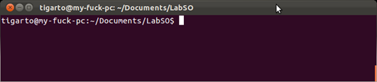
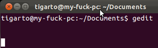
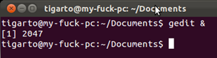
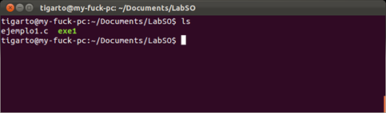
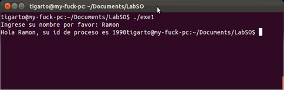
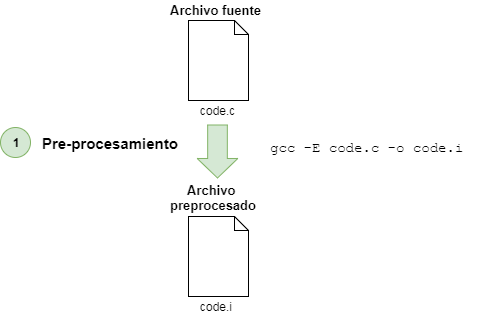
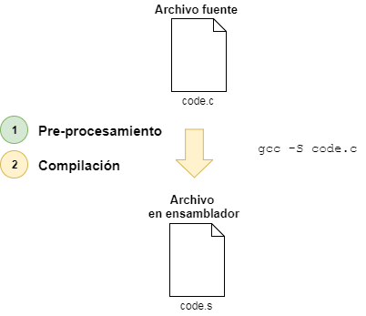
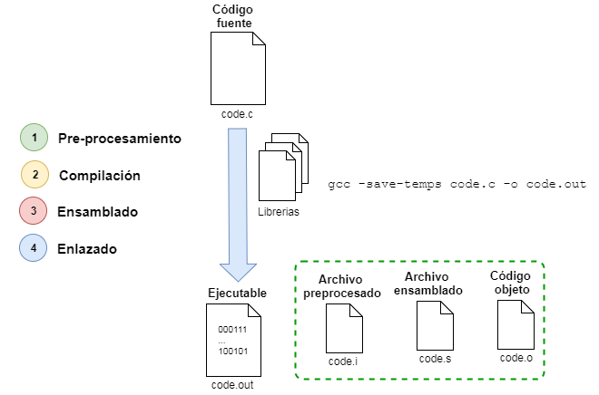

# Manejo básico del GNU Compiler Collection (GCC)

> **Objetivos**
> * Abordar el manejo del GCC como herramienta para la compilación de código en lenguaje de programación C.

## 1. Aspectos generales sobre el GCC
GCC es un compilador rápido, muy flexible, y riguroso con el estándar de C ANSI. Como ejemplo de sus múltiples virtudes, diremos que gcc puede funcionar como compilador cruzado para un gran número de arquitecturas distintas. GCC no proporciona un entorno de desarrollo (IDE), es sólo una herramienta que se utiliza en el proceso de creación de un programa. GCC se encarga de realizar el preprocesado del código, la compilación, y el enlazado. Dicho de otra manera, nosotros proporcionamos a GCC nuestro código fuente en el lenguaje de programación C, y él nos devuelve un archivo binario compilado para nuestra arquitectura.

## 2. Manejo básico del GCC

### 2.1. Elementos necesarios
Para compilar un programa se necesitan 3 elementos principalmente. En nuestro caso:
* **PC con un sistema operativo**: Puede ser cualquier sistema operativo pero es preferiblemente que sea Linux.
* **Un compilador**: Las versiones de Linux suelen venir con el compilador gcc; en el caso de Windows, es necesario descargarlo, existen dos que pueden ser útiles: el Cygwin y el MinGW.
* **Un Editor de textos o entorno de desarrollo (IDE)**: Dentro de Linux un editor muy empleado es el Gedit, aunque también se pueden trabajar con editores de consola como el **nano**, el **pico**, el **vi**, o incluso otros más poderosos como el **Emacs**. En lo que respecta a los entornos de desarrollo (IDEs) la ventaja de estos es que integran en un ambiente amigable las tareas de edición de código y compilación, dentro de los más comunes encontramos el Eclipse, el Netbeans, el Dev-C++ o el Geany entre otros.

### 2.2. Compilando el primer programa
A continuación se muestran los pasos que debe seguir para compilar programas, le recomendamos los siga en su equipo ya que este proceso será continuamente repetido cada vez que usted codifique un nuevo programa; si no tiene un equipo con linux por el momento, siga los pasos en un emulador de terminal online como el propuesto en el siguiente [enlace](https://www.tutorialspoint.com/unix_terminal_online.php) y emplee como editor de texto el **vi**. Una guía de comandos comunes para el vi se puede encontrar en la siguiente [tabla](https://free-electrons.com/doc/legacy/command-line/vi_memento.pdf), lo animamos a trabajar en lo que resta del curso con este o cualquier editor en modo texto, verá que es mucho mejor que un editor de texto una vez se alcance la práctica necesaria. 

A continuación se muestra el proceso que se sigue para codificar un programa (suponiendo que vamos a usar como editor grafico el gedit):


**Figura 1**. Proceso de compilacion completo

A continuación se describirán cada uno de los pasos de la figura anteriormente mostrada:
1. **Ubicarnos en el directorio de trabajo**: Para tal fin lo primero que hacemos es invocar la consola. Una vez allí nos ubicamos dentro de la carpeta en la cual deseamos trabajar. 

Suponiendo que nos encontramos en la carpeta **home del usuario**, **tigarto** en este caso, si se llegase a verificar con **pwd**, la ruta arrojada seria **/home/tigarto**. Luego por medio del comando **cd**, supongamos que nos desplazamos a directorio **Documents** dentro del directorio **home del usuario** para posteriormente (empleando **mkdir**) crear un directorio llamado **LabSO** con el fin de codificar y probar alli nuestros programas. Solo resta ingresar a este ultimo directorio con el comando **cd** y estamos listos para el siguiente paso. Para clarificar lo anterior, se muestran los comandos que se hubieran ejecutado en consola para el caso:

```
pwd        // Arroja: /home/tigarto
cd Documents
pwd        // Arroja: /home/tigarto/Documents 
mkdir labSO
cd labSO
pwd        // Arroja: /home/tigarto/Documents/labSO 
```

En la siguiente figura se muestra que ya nos encontramos en las ruta **/home/tigarto/Documents/labSO**



**Figura 2**. Directorio de trabajo

2. **Abrir el editor de texto**: Hay dos formas de hacer esto, desde el menú de Ubuntu o desde la terminal, colocando el nombre del editor, **gedit** en nuestro caso. La forma más recomendable al abrirlo desde la terminal es hacerlo en **background** colocando un **&** después del nombre del editor pues así la consola no se bloquea, para esto digitaríamos en consola: **gedit &**. La siguientes figuras muestran los 3 modos de abrir el editor.


**Figura 3**. Abriendo el editor desde el menú



**Figura 4**. Abriendo el editor desde la consola (la cual se bloquea)



**Figura 5**. Abriendo en background el editor desde la consola (la cual no se bloquea)

3. **Editar el archivo fuente**: Una vez abierto el editor, se codifica el programa y se guarda en la ruta deseada (para este ejemplo **/home/tigarto/Documents/LabSO**), el nombre de este debe tener extensión **.c**. Para ello codifique el siguiente código fuente y guardelo con el nombre de **ejemplo1.c**:

```C
/* ejemplo1.c
 * Author - Sistemas Operativos UdeA
 * Purpose - Ejemplo de bienvenida
 */

#include <stdio.h>
#include <unistd.h>

char nombre[50];
int main(void) {
 int pid = getpid();
 /* Solicitud de los datos al usuario */
 printf("Ingrese su nombre por favor: ");                   // Despliegue en pantalla
 scanf("%s", nombre);                                       // Entrada de datos
 /* Salida el programa */
 printf("Hola %s, su ID de proceso es %d\n", nombre, pid);  
 return 0;
}
```
La siguiente figura muestra el anterior codigo codificado en gedit.


**Figura 6**. Codigo codificado en el editor de texto


Después de que el programa se editó, se verifica que si se halla guardado en el directorio de trabajo con el comando **ls** tal y como se muestra en la siguiente figura: 


**Figura 7**. Verificacion del archivo codificado

4. **Compilar el programa**: Para compilar el programa se usa el comando gcc de la siguiente manera:

>  
> ``` gcc archivoFuente –o nombreEjecutable ```
>
> Dónde:
> * **archivoFuente**: Archivo de extensión **.c** que será compilado y enlazado.
> * **nombreEjecutable**: Nombre del ejecutable generado tras la ejecución del comando.
>
> La anterior forma de uso del comando gcc, suele ser la más sencilla para compilar y enlazar un archivo fuente (archivo 
> **.c**) de modo que se genera un ejecutable con nombre dado  por **nombreEjecutable**. Sin embargo este comando permite 
> muchas más posibilidades las cuales para más información pueden ser consultadas en: 
> http://www.mhe.es/universidad/informatica/8448198441/archivos/apendice_general_1.pdf 

En la siguiente figura se muestra el empleo de este comando en nuestro caso particular. Nótese que **archivoFuente=ejemplo1.c** y **nombreEjecutable=exe1** para nuestro caso.


**Figura 8**. Compilacion del programa

A veces suele ser común que el programa en cuestión tenga errores de sintaxis, en cuyo caso el compilador los muestra y no genera el ejecutable hasta que todos hayan sido corregidos; de este modo, si hay un error, se debe corregir en el editor, por el contrario, si todo está bien entonces el compilador generará el ejecutable.



**Figura 9**. Compilacion del programa

Como  se muestra en la figura anterior, si la compilación esta buena, el resultado será el archivo exe1 en nuestro caso.

5. **Ejecutar el programa**: Para probar el ejecutable generado se coloca el nombre del ejecutable antecedido por **./**, en este ejemplo como el ejecutable se llama **exe1**, entonces para su ejecución tecleamos **./exe1** tal y como se muestra a continuación:



**Figura 9**. Compilacion del programa

## 3. GCC con un poco más de detalle

El proceso de obtener un archivo ejecutable (entendible por la máquina) a partir de un archivo fuente (escrito en lenguaje de programación y entendido por el programador) involucra 4 etapas (ver figura 10), las cuales son principalmente:
1. Pre-procesamiento.
2. Compilación.
3. Ensamblado.
4. Enlazado.


**Figura 10**. Etapas del proceso de compilacion 


En las seccion anterior, se llegó a la obtención del ejecutable directamente mediante la ejecución de un solo comando, sin embargo en esta parte se analizaán cada una de estas etapas y las opciones involucradas en la herramienta GCC asociadas. 

### 3.1. Pasos iniciales
Codifique el siguiente programa empleando el editor de textos de su elección:

```C
#include <stdio.h>

#define TEST "Hello world!!!\n"

/* Programa que imprime un mensaje en pantalla */
int main(int argc, char *argv[])
{
  char str[] = TEST;
  printf("%s",str);
  return 0;
}
```

### 3.2. Compilando el archivo por pasos
A continuación se muestra el proceso de compilación por pasos y se resalta el archivo generado en cada uno de ellos.

#### 1 Pre-procesado
En esta etapa se interpretan las directivas al pre-procesador y se eliminan comentarios si los hay. En lo que respecta a las directivas del preprocesador, estas son sustituidas en el código por su valor en todos los lugares donde aparece su nombre. 

Las directivas del pre-procesador comienzan con #, permiten buenas prácticas de programación. Estas se usan principalmente para:
* Inserción de contenido de un archivo en su programa:  ```#include```
* Definición de macros para reemplazar una cadena por otra: ```#define```
* Permite la compilación de partes de un programa (Escritura de código fuente para dos o más sistemas) :  ```#if```, ```#ifdef```, ```#else```, ```#endif```

Para llevar a cabo el pre-procesado de un archivo fuente se ejecuta la opcion -E, de la siguiente manera:

```
gcc -E archivoFuente <-o archivoResultante>
``` 

La siguiente figura muestra el resultado de ejecutar el comando anterior:

	

**Figura 11**. Resultado del preprocesamiento de un archivo fuente 

La parte asociada con **-o** es opcional y si no se usa el resultado del preprocesamiento aparece en pantalla. Para nuestro caso se empleó el nombre del archivo resultante con extensión .i así:
```
gcc -E hello.c -o hello.i
``` 
Después de ejecutar el comando anterior es bueno verificar que el archivo si se haya generado usando el comando ```ls```, si se desea ver su contenido se puede emplear cualquier editor de texto o los comandos ```cat``` o ```less```. Por ejemplo al ejecutar el comando ```cat hello.i``` el resultado es similar al siguiente:

```
# 1 "hello.c"
# 1 "<built-in>"
# 1 "<command-line>"
# 1 "hello.c"
# 1 "/usr/include/stdio.h" 1 3 4
# 28 "/usr/include/stdio.h" 3 4
# 1 "/usr/include/features.h" 1 3 4
# 361 "/usr/include/features.h" 3 4
# 1 "/usr/include/sys/cdefs.h" 1 3 4
# 373 "/usr/include/sys/cdefs.h" 3 4
# 1 "/usr/include/bits/wordsize.h" 1 3 4
# 374 "/usr/include/sys/cdefs.h" 2 3 4
# 362 "/usr/include/features.h" 2 3 4
# 385 "/usr/include/features.h" 3 4
# 1 "/usr/include/gnu/stubs.h" 1 3 4

...

# 2 "hello.c" 2


int main(int argc, char *argv[])
{
  char str[] = "Hello world!!!\n";
  printf("%s",str);
  return 0;
}
```
#### Preguntas:
* ¿Qué cambios nota en hello.i respecto a hello.c?

#### 2. Compilación
La compilación transforma el código C en el lenguaje ensamblador propio del procesador de nuestra máquina (para conocer la información asociada al procesador de la máquina puede ejecutar el comando ```lscpu```).

La compilación se lleva a cabo con la opción ```-S```. Para el caso, este comando lleva a cabo el preprocesado y la compilación, la única diferencia radica en que el archivo resultante del pre-procesamiento es eliminado dejando solo el archivo devuelto al compilar. El comando para hacer esta tarea se muestra a continuación:
```
gcc -S archivoFuente <-o archivoResultante>
```

La siguiente figura muestra el resultado de ejecutar el comando anterior:

	

**Figura 12**. Resultado del comando gcc con la opcion para realizar la compilacion

Para el caso, también es opcional la opción ```-o```; sin embargo, no es necesario su uso a menos que se quiera renombrar el archivo resultante. Por defecto, el resultado de la ejecución de este comando (sin hacer uso de ```-o``` es un archivo resultante con el mismo nombre del archivo fuente pero con extencion .s). Para el caso, se ejecutó el comando de la siguiente manera:
```
gcc -S hello.c
```
Si ejecuta el comando para listar los archivos de un directorio podrá notar un nuevo archivo, ¿Cuál es?. Para ver el contenido del archivo resultante, puede ejecutar el comando ```cat hello.s```, parte del resultado se muestra a continuación:
```
        .file   "hello.c"
        .section        .rodata
.LC0:
        .string "%s"
        .text
.globl main
        .type   main, @function
main:
.LFB0:
        .cfi_startproc
        pushq   %rbp
        .cfi_def_cfa_offset 16
        .cfi_offset 6, -16
        movq    %rsp, %rbp
        .cfi_def_cfa_register 6
        subq    $32, %rsp
        movl    %edi, -20(%rbp)
        ...
        .cfi_endproc
.LFE0:
        .size   main, .-main
        .ident  "GCC: (GNU) 4.4.7 20120313 (Red Hat 4.4.7-11)"
        .section        .note.GNU-stack,"",@progbits
```
#### 3. Ensamblado
El ensamblado transforma el programa escrito en lenguaje ensamblador a código objeto, un archivo binario en lenguaje de máquina ejecutable por el procesador. Para crear el código objeto se usa el comando gcc con la opción ```-c``` así:
```
gcc -c archivoFuente <-o archivoResultante>
```  

La siguiente figura muestra el resultado de ejecutar el comando anterior:

	

**Figura 13**. Resultado del comando gcc con la opcion para realizar el proceso de ensamblado

El archivo objeto resultante tiene el mismo nombre que el archivo fuente pero su extensión es **.o**. La opción -o sigue siendo opcional y cumple los mismos propositos que los mencionados con anterioridad (¿cuáles?). Para el caso, el comando aplicado es:
```
gcc -c hello.c
``` 
El resultado de este comando será el archivo **hello.o** Puede verificarse el tipo de archivo usando el comando ```file hello.o``` tal y como se muestra a continuación:
```
file hello.o
hello.o: ELF 64-bit LSB relocatable, x86-64, version 1 (SYSV), not stripped
``` 
Como el archivo objeto generado en código binario el uso de editores de texto o comandos como cat no es apropiado. Para la visualización de archivos de este tipo se emplean programas como ```readelf``` o ```objdump```. A continuación se muestra el resultado de usar el comando ```objdump``` con las opciones ```-d``` y ```-h```:
```
objdump -d hello.o

hello.o:     file format elf64-x86-64


Disassembly of section .text:

0000000000000000 <main>:
   0:   55                      push   %rbp
   1:   48 89 e5                mov    %rsp,%rbp
   4:   48 83 ec 20             sub    $0x20,%rsp
   8:   89 7d ec                mov    %edi,-0x14(%rbp)
   b:   48 89 75 e0             mov    %rsi,-0x20(%rbp)
   f:   c7 45 f0 48 65 6c 6c    movl   $0x6c6c6548,-0x10(%rbp)
  16:   c7 45 f4 6f 20 77 6f    movl   $0x6f77206f,-0xc(%rbp)
  1d:   c7 45 f8 72 6c 64 21    movl   $0x21646c72,-0x8(%rbp)
  24:   c7 45 fc 21 21 0a 00    movl   $0xa2121,-0x4(%rbp)
  2b:   b8 00 00 00 00          mov    $0x0,%eax
  30:   48 8d 55 f0             lea    -0x10(%rbp),%rdx
  34:   48 89 d6                mov    %rdx,%rsi
  37:   48 89 c7                mov    %rax,%rdi
  3a:   b8 00 00 00 00          mov    $0x0,%eax
  3f:   e8 00 00 00 00          callq  44 <main+0x44>
  44:   b8 00 00 00 00          mov    $0x0,%eax
  49:   c9                      leaveq
  4a:   c3                      retq

objdump -f hello.o

hello.o:     file format elf64-x86-64
architecture: i386:x86-64, flags 0x00000011:
HAS_RELOC, HAS_SYMS
start address 0x0000000000000000
```
### 4. Enlazado
Existen funciones de C incluídas en nuestro código que se encuentran ya compiladas y ensambladas en bibliotecas existentes en el sistema, por lo que se hace preciso vincular de algún modo el código binario de éstas a nuestro ejecutable. Dicha vinculación se lleva en la etapa de enlazado, aquí se reúnen uno o más módulos en código objeto con el código existente en las bibliotecas. 

Por ejemplo, en nuestro caso, el archivo **hello.c** emplea la funcion **printf** cuyo ejecutable hace parte de la libreria estandar de C (libc) (Para conocer la ubicacion de esta librería se puede ejecutar el comando ``` gcc --print-file-name=libc.a```, ```gcc --print-file-name=libc.so``` o también con el comando ```locate```de la siguiente manera: ```locate libc.a``` o ```locate libc.so```).

El enlazador se denomina **ld**. El uso directo del enlazador **ld** es muy poco frecuente. En su lugar suele proveerse a gcc los códigos objeto directamente con el siguiente formato:

```
gcc archivoObjeto <-o ejecutable>
```

En la siguiente figura se muestra el empleo de este comando:

	

**Figura 14**. Resultado del comando gcc con la opcion para realizar el proceso de enlazado partiendo del codigo objeto


Para nuestro caso, se ejecutaría el comando anterior de la siguiente manera:
```
gcc hello.o -o hello.out
```
Una vez se ejecuta el comando anterior, el resultado será el archivo ejecutable **hello.out**. Como se vió anteriormente, el uso del parametro **-o** es opcional y cuando éste no se emplea, el archivo resultante tendrá el nombre de **a.out** (pruébelo usted mismo).

Una vez se tiene el ejecutable solo resta invocarlo, esto se hace de la siguiente manera:
```
ruta/nombreEjecutable
```
Para nuestro caso, como el ejecutable es **hello.out** y estamos ubicados en el directorio en el cual éste se encuentra el comando de ejecución sería el siguiente:
```
./hello.out
```
El resultado de la ejecución del comando anterior será:
```
Hello world!!!
``` 
Para visualizar la estructura del ejecutable se utilizan comandos como ```objdump```, ```readelf``` o ```nm``` (algunos ya mencionados), la interpretación de los resultados arrojados por comandos como estos es de vital importancia para hacer tareas de ingeniería inversa.

#### Repaso de los comandos anteriores
La siguiente tabla resume los comandos aplicados anteriormente:

| Paso | Acción            | Comando                                     | Ejemplo                   | Archivo generado |
|------|-------------------|---------------------------------------------|---------------------------|------------------|
| 1    | Pre-procesamiento | gcc -E archivoFuente <-o archivoResultante> | gcc -E hello.c -o hello.i | hello.i          |
| 2    | Compilación       | gcc -S archivoFuente <-o archivoResultante> | gcc -S hello.c            | hello.s          |
| 3    | Ensamblado        | gcc -c archivoFuente <-o archivoResultante> | gcc -c hello.c            | hello.o          |
| 4    | Enlazado          | gcc archivoObjeto <-o ejecutable>           | gcc hello.o -o hello.out  | hello.out        |

#### Todo en un solo paso (generando como resultado solo el archivo ejecutable)
Al principio de esta guía, se mostró como a partir del comando gcc se podía generar el ejecutable a partir del codigo objeto, a modo de repaso el comando es: ///Danny: Revisar redacción, no entendí

``` gcc archivoFuente –o nombreEjecutable ```

Para este caso específico se tiene lo siguiente:

``` gcc hello.c –o hello.out ```

Es de notar que el comando anterior realiza de una vez todos los cuatro pasos anteriormente citados eliminando los archivos intermedios resultantes en el proceso (hello.i, hello.s, hello.o)

#### Todo en un solo paso (generando el archivo ejecutable y dejando los archivos intermedios)
Cuando se ejecuta el comando ```gcc``` con la opción ```-save-temps``` los archivos intermedios resultantes de cada uno de los pasos no son eliminados, la forma como se ejecuta este comando es la siguiente:

``` gcc -save-temps archivoFuente <–o nombreEjecutable>```

	

**Figura 15**. Resultado del comando gcc conservando los archivos intermedios del proceso


Para nuestro caso específico el comando será:

``` gcc -save-temps hello.c –o hello.out ```

Si se verifica la lista de archivos con el comando ls (suponiendo que solo existe el archivo fuente en el directorio actual) el resultado será el archivo ejecutable junto con los archivos intermedios resultantes de cada etapa.

## 4. Otras opciones con el gcc
A continuación mostramos algunas de las opciones más habituales al usar gcc (algunas ya vistas):

| Opcion | Descripción            |
|------|-------------------|
| -help | Indica a gcc que muestre su salida de ayuda (muy reducida).|
| -o <file> | El archivo ejecutable generado por gcc es por defecto a.out. Mediante este modificador, le especificamos el nombre del ejecutable.|
| -Wall | No omite la detección de ningún warning. Por defecto, gcc omite una colección de warnings  "poco importantes".|
| -g | Incluye en el binario información necesaria para utilizar un depurador posteriormente.|
| -O <nivel> | Indica a gcc que utilice optimizaciones en el código. Los niveles posibles van desde 0 (no optimizar) hasta 3 (optimización máxima). Utilizar el optimizador aumenta el tiempo de compilación, pero suele generar ejecutables más rápidos.|
| -E | Sólo realiza la fase del preprocesador, no compila, ni ensambla, ni enlaza.|
| -S | Preprocesa y compila, pero no ensambla ni enlaza.|
| -c | Preprocesa, compila y ensambla, pero no enlaza.|
| -I <dir> | Especifica un directorio adicional donde gcc debe buscar los archivos de cabecera indicados en el código fuente.|
| -L <dir> | Especifica un directorio adicional donde gcc debe buscar las librerías necesarias en el proceso de enlazado.|
| -L <dir> | Especifica un directorio adicional donde gcc debe buscar las librerías necesarias en el proceso de enlazado.|
| -l<library> | Especifica el nombre de una librería adicional que deberá ser utilizada en el proceso de enlazado.|

La colección completa de modificadores a utilizar con gcc se encuentra en su página de manual, **man gcc**, o también si esta muy embalado puede llamar a nuestro santo favorito **google**.

## 5. Enlaces de interes
* https://www.thegeekstuff.com/2011/10/c-program-to-an-executable/
* https://www.thegeekstuff.com/2011/10/c-program-to-an-executable/
* https://www.ibm.com/developerworks/aix/library/au-unixtools.html
* https://jlospinoso.github.io/developing/software/software%20engineering/reverse%20engineering/assembly/2015/03/06/reversing-with-ida.html
* https://www.perspectiverisk.com/intro-to-basic-disassembly-reverse-engineering/
* https://www.thegeekstuff.com/2012/03/linux-nm-command/
