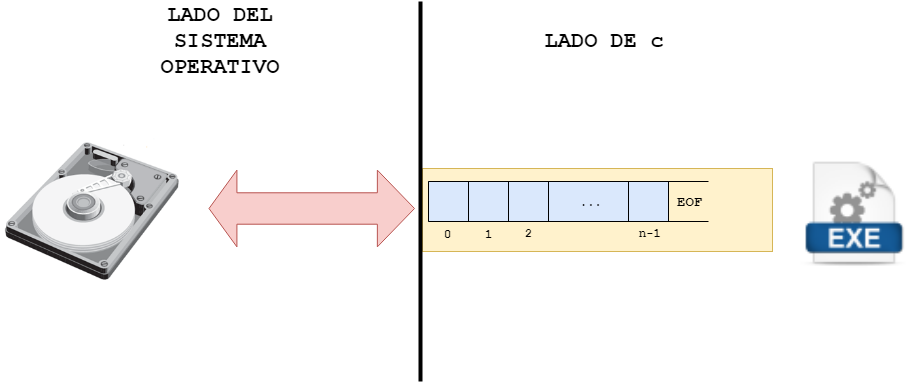
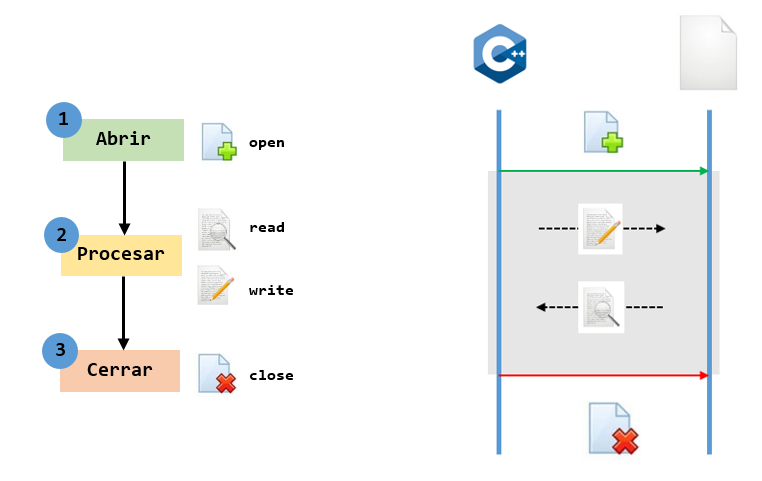

# Manejo de archivos en C

## 1. Conceptualización

### 1.1. ¿Que son los archivos?

Un archivo es una colección de información almacenada en un dispositivo de memoria no volatil, usualmente el disco de un computador. Como la información no se pierde esta puede ser reutilizada una vez se ha guardado. 

### 1.2. ¿Para que se usan los archivos?

Los archivos son usados para almacenamiento permanente de grandes cantidades de datos ya que los datos almacenados en arreglos y variables solo existen temporalmente (Mientras el programa se ejecuta). A todo archivo le es asignado un nombre que es usado por el sistema operativo y por el usuario para propósitos de identificación.

## 2. Empleando C para el trabajo con archivos

### 2.1. Aspectos introductorios

Un concepto muy importante en C es el de **stream**. Un **stream** no es mas que una interfaz logica que permite el intercambio de datos entre una aplicacion y un archivo (en el sentido amplio de la palabra, se asocia no solo al disco duro sino que tambien puede hacer alusion a otros dispositivos como el teclado, la pantalla, etc.). Cuando se establece un intercambio de datos entre una aplicacion y un archivo se establece un buffer (flujo de bytes) que es intercambiado entre el dispositivo y la aplicación tal y como se muestra en la siguiente figura:



**Figura 1**. C stream.

Tal y como se muestra en la figura 2, el intercambio de informacion entre el archivo y la aplicacion implica tres actividades:
1. **Abrir el archivo**: con esto se indica que se va a iniciar una transferencia de datos asi como el sentido en el cual se va a llevar a cabo.
2. **Procesar los datos**: en esta parte la aplicacion lleva a cabo el desarrollo de la logica como tal; esta puede implicar el procesamiento de informacion y el uso de instrucciones (lectura/escritura) para intercambio de datos entre el archivo y la aplicacion.
3. **Cerrar el archivo**: lo cual indica que se dara por terminada la transferencia de datos entre este y la aplicacion.



**Figura 2**. Trabajando con archivos. 

### 2.2. Usando archivos en C

A continuación se describiran la forma como se llevan a cabo cada una de las actividades previamente citadas:

#### 2.2.1. Abriendo el archivo

Abrir el archivo implica dos cosas:
1. Declarar un apuntador a ```FILE```
2. Hacer uso de la funcion ```fopen```

**Declarando un apuntador a FILE**

```FILE``` es una estructura definida en la libreria ```stdio.h``` (no olvidar incluir en el archivo fuente) para trabajar con archivos, de modo que el primer paso para empezar el proceso de trabajar con archivos consiste en la declaracion de un apuntador a este tipo de dato. La forma para esto es la siguiente:

```C
FILE *file_pointer_name,..;
```

Por ejemplo a continuacion se declaran dos apuntadores a FILE:

```C
FILE *ifp;
FILE *ofp;
```
**Abriendo un archivo**
Para abrir un archivo y asociarlo con un stream se usa la funcion ```fopen()``` cuyo prototipo se muestra a continuacion:

```C
FILE *fopen(const char *fname, const char *mode);
```

**Donde**:
* **fname** esta asociado al nombre del archivo.
* **mode** opcion que indica a C si el archivo se va a leer, a escribir o a modificar entre otras. La siguiente tabla describe las opciones disponibles el modo.


| Modo  | Significado |
| ------------- | ------------- |
| r | Abre un archivo de texto para lectura  |
| w  | Abre un archivo de texto para escritura  |
| a  | Agrega contenido a un archivo de texto  |
| rb  | Abre un archivo binario para lectura  |
| wb  | Abre un archivo binario para escritura  |
| ab  | Agrega contenido a un archivo binario |
| r+  | Abre un archivo de texto para leer/escribir  |
| w+ | Crea un archivo de texto para leer/escribir   |
| a+ | Abre o crea un archivo de texto para leer/escribir  |
| r+b | Abre binario para leer/escribir  |
| w+b | Crea binario para leer/escribir  |
| a+b | Abre o crea binario para leer/escribir  |

Si el programa abre exitoramente el archivo, fopen() devuelve un apuntador a file pointer el cual puede ser empleado para aplicar otras funciones de I/O sobre el archivo asociado (como lo veremos despues). Por otro lado, si hay un error, el valor retornado sera un puntero nulo.

**Code snippets**

1. Crear un archivo de texto llamado **data.dat** y dejandolo listo para escribir

```C
#include <stdio.h>
#include <string.h>

...
// Abriendo el archivo
FILE *outFile;
inFile = open("data.dat","w");
// Este codigo continuara...
```

2. Abrir para leer un archivo llamado "lista.txt"

```C
#include <stdio.h>
#include <string.h>

...
// Abriendo el archivo
FILE *inFile;
inFile = open("lista.txt","r");
// Verificando que el archivo se haya abierto
if(inFile == NULL) {
  printf("No se puede abrir lista.txt\n");
  exit(1);
}
// Este codigo continuara...
```
Note que se chequeo el resultado de **fopen**. Esta función puede devolver NULL mas espeficicamente por cosas como:
* Usar un nombre de archivo invalido.
* Intentar abrir un archivo en un disco que no esta listo; por ejemplo, cuando el disco no esta formateado.
* Intentar abrir un archivo en un directorio inexistente o en un disco duro inexistente.
* Intentar abrir un archivo inexistente en modo **r**.

3. Abrir para leer un archivo. Su nombre debera ser pasado por teclado.

```C
#include <stdio.h>
#include <string.h>

...
// Abriendo el archivo
char filename[80];
FILE *fp;
printf("Entre el nombre del archivo que sera abierto: ");
gets(filename); 
fp = open(filename,"r");
// Verificando que el archivo se haya abierto
if(fp == NULL) {
  printf("Can not open %s\n", filename);
  exit(1);
}
// Este codigo continuara...
```

Como se puede ver en el código anteriormente mostrado, se empleo la funcion fgets() la cual es una funcion como scanf para entrada de datos desde el teclado. Para mas informacion sobre esta, puede consultar el siguiente [enlace](http://c.conclase.net/librerias/?ansifun=fgets).

4. Crear un archivo dentro del directorio **/home/vito.corleone**. El nombre del archivo sera pasado por teclado.

```C
#include <stdio.h>
#include <string.h>

...
// Abriendo el archivo
char path[] = "/home/vito.corleone/"
char filename[80];
char fullName[161]; 
FILE *fp;
printf("Entre el nombre del archivo que sera abierto: ");
gets(filename);
strcat(fullName, path);
strcat(fullName, filename);
fp = open(fullName,"w");
// Este codigo continuara...
```
Para obtener el nombre completo del archivo (ruta + nombre) se uso la función **strcat** que concatena dos cadenas de caracteres. Para mas informacion sobre esta puede consultar el siguiente [enlace](http://c.conclase.net/librerias/?ansifun=strcat)

#### 2.2.2. Cerrando el archivo el archivo
Despues de completarse el procesamiento de un archivo, este debe ser cerrado y para ello se emplea la funcion fclose(). El prototipo de la funcion fclose es el siguiente:

```C
int fclose(FILE *fp);
```

**Donde**:
* **fp** es el FILE pointer asociado con el stream.

La funcion anterior retorna 0 si el stream fue cerrado con exito o -1 si hay errores.

**Code snippets**

1. En el siguiente ejemplo se muestra como se cierra un archivo despues de que este ha sido abierto.

```C
#include <stdio.h>
#include <string.h>

...
// Abriendo el archivo
char fullName[] = "/home/vito.corleone/data.dat"
fout = open(fullName,"w");
// Este codigo continuara

...
// Cerrando el archivo
fclose(fout);
```

#### 2.2.3. Trabajando con archivos

C proporsiona varias funciones para leer y escribir archivos, la siguiente tabla muestra algunas de ellas:

| Modo  | Funciones |
| ------------- | ------------- |
| Lectura | fscanf, fgets, fgetc, fread |
| Escrirtura | fprintf, fputs, fputc, fwrite |

#### 2.2.3.1. Entrada y salida por caracteres

Para leer y escribir archivos de caracter en caracter se emplea las funciones **getc** y **putc** respectivamente. A continuación se hablará de cada una de estas

#### 2.2.3.1.1. Funcion putc
Permite escribir un unico caracter a un stream especifico. El prototipo de esta se muestra a continuacion:

```C
int putc(int ch, FILE *fp);
```

**Donde**:
* **ch** es el caracter que sera escrito.
* **fp** es el file pointer asociado al archivo despues de que este ha sido abierto mediante la funcion fopen.

La funcion retorna el caracter que se acabo de escribir si el proceso fue exitoso o EOF (constante simbolica definida en stdio.h cuyo valor es -1) si un error ocurre.

**Ejemplo**
1. Una cadena de ADN puede se representa mediante un alfabeto de 4 simbolos ('A', 'C', 'G' y 'T'). Hacer un programa que permita generar una archivo con una cadena de ADN cuyo tamaño y nombre sea ingresado por el usuario.

**Solucion**: En [write_caracter.c](./code/write_caracter.c) se encuentra la solucion de este programa. Por comodidad aqui tambien se pone:

```C
#include <stdio.h>
#include <stdlib.h>
#include <time.h>

char generarCaracter(void);

int main() {
  srand(time(NULL)); // Inicializacion del generador
  char filename[80];
  int tam;
  char ch;
  FILE *outFile;
  printf("Ingrese el nombre de la cadena de ADN a generar: ");
  scanf("%[^\n]s",filename); // Formato para que la entrada pueda aceptar espacios
  printf("Ingrese el tamaño de la cadena: ");
  scanf("%d",&tam);
  outFile = fopen(filename,"w");
  for(int i = 0; i < tam; i++) {
    ch = generarCaracter(); // Generacion de la letra
    putc(ch,outFile);
  }
  putc('\0',outFile);
  fclose(outFile);
  exit(0);
}

char generarCaracter(void) {
  int randomNum = rand()%4; //Generando un aleatorio entre 0 y 3
  switch(randomNum) {
    case 0:
      return 'A';
    case 1:
      return 'G';
    case 2:
      return 'T';
    case 3:
      return 'C';
  }
}
```

#### 2.2.3.1.2. Funcion getc
Permite leer un unico caracter de un stream especifico. El prototipo de esta se muestra a continuacion:

```C
int getc(FILE *fp);
```

**Donde**:
* **fp** es el file pointer asociado al archivo despues de que este ha sido abierto mediante la funcion fopen.

La funcion retorna el caracter que fue leido **EOF** (-1) en caso de error.

**Ejemplo**
1. Hacer un programa que lea un archivo de texto caracter por caracter y lo imprima en pantalla.

**Solucion**: [read_caracter.c](./code/read_caracter.c) es el codigo solucion. Por comodidad se muestra este codigo a continuación:

```C
#include <stdio.h>
#include <stdlib.h>
#include <time.h>

int main() {
  srand(time(NULL)); // Inicializacion del generador
  char filename[80];
  int tam;
  char ch;
  FILE *inputFile;
  printf("Ingrese el nombre de la cadena de ADN a generar: ");
  scanf("%[^\n]s",filename); // Formato para que la entrada pueda aceptar espacios
  inputFile = fopen(filename,"r");
  if (inputFile == NULL) {
    printf("Error al abrir el archivo %s\n", filename);
    exit(-1);
  }
  do {
    ch = getc(inputFile);
    printf("%c", ch);
  } while(ch != EOF);
  printf("\n");
  fclose(inputFile);
  exit(0);
}
```

2. Hacer un programa que abra un archivo que contiene una cadena de ADN y genere un archivo de salida con el numero de cada uno de los caracteres el alfabeto genetico ('A', 'G', 'G' y 'C') separados por espacio. El nombre del archivo sera **inventario_nombreArchivo**. Asi por ejemplo si se tiene un archivo con el siguiente nombre **secuencia.dat** con el siguiente contenido:

```
AGCTTTTCATTCT
```

La salida sera un archivo llamado **inventario_secuencia.dat** y su contenido será el siguiente:

```
2 1 7 2
```

**Solución**: En [read_write_caracter.c](./code/read_write_caracter.c) se muestra el codigo solución, por comodidad a continuación tambien aparece:

```C
#include <stdio.h>
#include <stdlib.h>
#include <string.h>

int main() {
  char inFilename[80];
  char outFilename[80] = "inventario_";
  char cntS[10];
  int tam;
  char ch;
  int cnt[] = {0,0,0,0}; 
  FILE *inFile;
  FILE *outFile;
  int i, j;
  printf("Ingrese el nombre de la cadena de ADN a generar: ");
  scanf("%[^\n]s",inFilename); // Formato para que la entrada pueda aceptar espacios
  inFile = fopen(inFilename,"r");
  if (inFile == NULL) {
    printf("Error al abrir el archivo %s\n", inFilename);
    exit(-1);
  }
  do {
    ch = getc(inFile);
    if(ch == 'A') {
      cnt[0]++;
    }
    else if(ch == 'G') {
      cnt[1]++;
    }
    else if(ch == 'T') {
      cnt[2]++;
    }
    else if(ch == 'C') {
      cnt[3]++;
    }
  } while(ch != EOF);
  fclose(inFile);
  strcat(outFilename,inFilename);
  outFile = fopen(outFilename,"w");
  for(i = 0; i < 4; i++) {
    snprintf(cntS,10,"%d", cnt[i]);
    j = 0;
    while(cntS[j] != '\0') {
      putc(cntS[j],outFile);
      j++;
    }
    putc(' ',outFile);
  }
  putc('\0',outFile);
  fclose(outFile);
  exit(0);
}
```

Hay que resaltar que en el codigo anterior, hay algunas funciones que no se han visto pero que pueden ser consultadas en internet, a continuacion como [strcat](https://www.ibm.com/support/knowledgecenter/en/ssw_ibm_i_73/rtref/strcat.htm) y [snprintf](https://www.ibm.com/support/knowledgecenter/en/ssw_ibm_i_73/rtref/snprintf.htm). Lo animamos a que observe la descripcion y ejemplos de los enlaces y comprenda como se usan estos en el programa.

#### 2.2.3.1.3. Funcion gets
Es una funcion empleada para leer un archivo linea por linea. El prototipo de la funcion es el siguiente:

```C
char *fgets(char *str, int n, FILE *fp);
```

**Donde**:
* **str** cadena de caracteres a la que se llevara la parte leida del archivo.
* **n** numero maximo de caracteres a leer tenieno en cuenta el NULL. Por lo tanto el maximo de caracteres es de **n - 1**.
* **fp** es el file pointer asociado al archivo despues de que este ha sido abierto mediante la funcion fopen.

La funcion detiene la lectura si:
* Se han leido ya n - 1 caracteres.
* Se a encontrado el caracter de nueva linea.
* Se ha alcanzado el final del archivo.
* Se ha lanzado un error de lectura.

Esta funcion agreda un terminador null a los datos leidos, comparada con la version de lectura caracter por caracter (getc) esta funcion es maas eficiente.

**Ejemplos**:

1. Hacer un programa que lea un archivo y lo muestre en pantalla. Este programa, debera mostrar ademas el numero de linea asociado. Por ejemplo, supongase que se tiene un archivo de texto llamado "frases.txt"

```
La vida es una obra teatral que no importa cuánto haya durado, sino lo bien que haya sido representada. 
Séneca

Estar preparado es importante, saber esperar lo es aún más, pero aprovechar el momento adecuado es la clave de la vida. 
Arthur Schnitzler

¡Qué pequeñas son mis manos…! En relación con todo lo que la vida ha querido darme.
Ramón J. Sénder

Todo el mundo trata de realizar algo grande, sin darse cuenta de que la vida se compone de cosas pequeñas. 
Frank Clark

Sólo le falta el tiempo a quien no sabe aprovecharlo. 
Jovellanos

Nuestra mayor gloria no está en no caer nunca, sino en levantarnos cada vez que caemos. 
Confucio

La alegría cuanto más se gasta, más queda. 
Ralph Waldo Emerson

Se necesitan dos años para aprender a hablar, y sesenta para aprender a callar. 
Ernest Hemingway
```
Cuando se muestre en pantalla sera:

```
1   La vida es una obra teatral que no importa cuánto haya durado, sino lo bien que haya sido representada. 
2   Séneca
3
4   Estar preparado es importante, saber esperar lo es aún más, pero aprovechar el momento adecuado es la clave de la vida. 
5   Arthur Schnitzler
6
7   ¡Qué pequeñas son mis manos…! En relación con todo lo que la vida ha querido darme.
8   Ramón J. Sénder
9  
10  Todo el mundo trata de realizar algo grande, sin darse cuenta de que la vida se compone de cosas pequeñas. 
11  Frank Clark
12
13  Sólo le falta el tiempo a quien no sabe aprovecharlo. 
14  Jovellanos
15
16  Nuestra mayor gloria no está en no caer nunca, sino en levantarnos cada vez que caemos. 
17  Confucio
18
19  La alegría cuanto más se gasta, más queda. 
20  Ralph Waldo Emerson
21
22  Se necesitan dos años para aprender a hablar, y sesenta para aprender a callar. 
23  Ernest Hemingway
```
**Solucion**: El archivo [read_linea.c](./code/read_linea.c) contiene la sulucion. A continuacion se muestra este por comodidad:

```C
#include <stdio.h>
#include <stdlib.h>
#include <time.h>

int main() {
  char filename[80];
  char line[201];
  int numLinea = 1;
  FILE *iF;
  printf("Ingrese el nombre del archivo: ");
  fflush(stdin);
  scanf("%[^\n]s",filename); // Formato para que la entrada pueda aceptar espacios
  iF = fopen(filename,"r");
  if (iF == NULL) {
    printf("Error al abrir el archivo %s\n", filename);
    exit(-1);
  }
  while(fgets(line, 201, iF)!=NULL) {
    printf("%-5d",numLinea++);
    printf("%s",line);
  } 
  fclose(iF);
  exit(0);
}
```

#### 2.2.3.1.4. Funcion puts
Escribe una cadena de caracteres a un stream. El prototipo de la funcion es el siguiente:

```C
char fputs(char *str, FILE *fp);
```

**Donde**:
* **str** es un apuntador a una cadena de caracteres terminada con NULL.
* **fp** es el file pointer asociado al archivo despues de que este ha sido abierto mediante la funcion fopen.

La función retorna un valor no negativo si todo sale bien o EOF en caso de error.

**Ejemplo**:

1. Hacer un programa que lea una cadena de ADN de un archivo cualquiera y genere la cadena complementaria en otro archivo con **complemento_nombreArchivo** como nombre. Tenga en cuenta que en una cadena de ADN los pares complementarios son: 'A' con 'T' y 'G' con 'C'. Por ejemplo, si la cadena se llama **adn1.txt** y tiene el siguiente contenido:

```
AGTTTCTTAAGCCG
```

El resultado será una cadena llamada **complemento_adn1.txt** con el siguiente contenido:

```
TCAAAGAATTCGGC
```

**Solución**: El archivo [read_write_line1.c](./code/read_write_line1.c) contiene la sulucion. A continuacion se muestra este por comodidad:

```C
#include <stdio.h>
#include <stdlib.h>
#include <string.h>

void complementar(char *cad);

int main() {
  char inFilename[80];
  char outFilename[80] = "complemento_";
  char adn_string[21]; 
  FILE *inFile;
  FILE *outFile;
  printf("Ingrese el nombre de la cadena de ADN a generar: ");
  fflush(stdin);
  scanf("%[^\n]s",inFilename); // Formato para que la entrada pueda aceptar espacios
  strcat(outFilename,inFilename);
  inFile = fopen(inFilename,"r");
  outFile = fopen(outFilename,"w");
  if (inFile == NULL) {
    printf("Error al abrir el archivo %s\n", inFilename);
    exit(-1);
  }
  while(fgets(adn_string, 21, inFile)!=NULL) {
    complementar(adn_string);
    fputs(adn_string, outFile); 
  }
  fclose(inFile);
  fclose(outFile);
  exit(0);
}

void complementar(char *cad) {
  while(*cad != '\0') {
    switch(*cad) {
      case 'A':
        *cad = 'T';
        break;
      case 'T':
        *cad = 'A';
        break;
      case 'G':
        *cad = 'C';
        break;
      case 'C':
        *cad = 'G';
        break;
    }
    cad++;
  }
}
```

#### 2.2.3.1.5. Funcion fprintf
Esta trabaja de manera similar a printf, solo que lo que escribe no va a pantalla si no a un archivo. El prototipo de esta funcion es motrado a continuación:

```C
int fprintf(FILE *fp, const char *format, ...)
```

**Donde**:
* **fp** es el file pointer asociado al archivo despues de que este ha sido abierto mediante la funcion fopen.
* **format** es la cadena de caracteres en C que sera escrita, esta sigue la misma forma que el caso de **printf**

**Ejemplo**:

1. Hacer un programa que genere un archivo con N datos entre 0 y 100. Cada numero estara en un renglon.

**Solucion**: El archivo [write_line.c](./code/write_line.c) contiene la sulucion. A continuacion se muestra este por comodidad:

```C
#include <stdio.h>
#include <stdlib.h>
#include <string.h>
#include <time.h>

int main() {
  srand(time(NULL)); // Inicializacion del generador
  char outFilename[80];
  int N;
  int num;
  FILE *outFile;
  printf("Ingrese el nombre del archivo: ");
  fflush(stdin);
  scanf("%[^\n]s",outFilename); // Formato para que la entrada pueda aceptar espacios
  fflush(stdin);
  printf("La cantidad de numeros que desea que se guarden en este: ");
  scanf("%d", &N);
  outFile = fopen(outFilename,"w");
  for(int i = 0; i < N; i++) {
    num = rand()%101; //Generando un aleatorio entre 0 y 100
    // printf("%d\n",num);
    fprintf(outFile,"%d\n",num);
  }
  fclose(outFile);
  exit(0);
}
```

2. Este ejercicio ya se realizo empleando putc, pero para propositos de comparacion se va a realizar con fprintf. Hacer un programa que abra un archivo que contiene una cadena de ADN y genere un archivo de salida con el numero de cada uno de los caracteres el alfabeto genetico ('A', 'G', 'G' y 'C') separados por espacio. El nombre del archivo sera **inventario_nombreArchivo**. Asi por ejemplo si se tiene un archivo con el siguiente nombre **secuencia.dat** con el siguiente contenido:

```
AGCTTTTCATTCT
```

La salida sera un archivo llamado **inventario_secuencia.dat** y su contenido será el siguiente:

```
2 1 7 2
```

**Solucion**: Solución: En [read_write_line2.c](./code/read_write_line2.c) se muestra el codigo solución, por comodidad a continuación tambien aparece:

```C
#include <stdio.h>
#include <stdio.h>
#include <stdlib.h>
#include <string.h>

int main() {
  char inFilename[80];
  char outFilename[80] = "inventario_";
  char cntS[10];
  int tam;
  char ch;
  int cnt[] = {0,0,0,0}; 
  FILE *inFile;
  FILE *outFile;
  int i, j;
  printf("Ingrese el nombre de la cadena de ADN a generar: ");
  scanf("%[^\n]s",inFilename); // Formato para que la entrada pueda aceptar espacios
  inFile = fopen(inFilename,"r");
  if (inFile == NULL) {
    printf("Error al abrir el archivo %s\n", inFilename);
    exit(-1);
  }
  do {
    ch = getc(inFile);
    if(ch == 'A') {
      cnt[0]++;
    }
    else if(ch == 'G') {
      cnt[1]++;
    }
    else if(ch == 'T') {
      cnt[2]++;
    }
    else if(ch == 'C') {
      cnt[3]++;
    }
  } while(ch != EOF);
  fclose(inFile);
  strcat(outFilename,inFilename);
  outFile = fopen(outFilename,"w");
  for(i = 0; i < 4; i++) {
    fprintf(outFile, "%d ", cnt[i]);    

  }
  fclose(outFile);
  exit(0);
}
```

#### 2.2.3.1.6. Funcion fscanf
Esta trabaja de manera similar a scanf, solo que lo que toma no viene desde el teclado sino desde un archivo. El prototipo de esta funcion es mostrado a continuación:

```C
int fscanf(FILE *fp, const char *format, ...)
```

**Donde**:
* **fp** es el file pointer asociado al archivo despues de que este ha sido abierto mediante la funcion fopen.
* **format** es la cadena de caracteres en C que sera escrita, esta sigue la misma forma que el caso de **printf**

La gran ventaja de esta funcion es que una vez se obtiene el dato del archivo la conversion se hace de manera transparente. Es decir no es necesario usar explicitamente alguna funcion de convierta datos tipo string a otro tipo de datos como enteros o reales por ejemplo. Esto, simplifica enormemente la etapa de procesamiento del problema.

**Ejemplo**:

1. Hacer un programa que lea un archivo que contenga varios numeros enteros (uno por fila) y obtenga la suma y el promedio de estos los imprima en pantalla y los lleve a un archivo. 

**Solución**: El archivo [read_write_line3.c](./code/read_write_line3.c) contiene la sulucion. A continuacion se muestra este por comodidad:

```C
#include <stdio.h>
#include <stdio.h>
#include <stdlib.h>
#include <string.h>

int main() {
  char inFilename[80];
  char outFilename[80] = "inventario_";
  int tam = 0;
  long long sum = 0;
  int num;
  double prom;
  FILE *inFile;
  FILE *outFile;
  printf("Ingrese el nombre del archivo: ");
  fflush(stdin);
  scanf("%[^\n]s",inFilename); // Formato para que la entrada pueda aceptar espacios
  inFile = fopen(inFilename,"r");
  if (inFile == NULL) {
    printf("Error al abrir el archivo %s\n", inFilename);
    exit(-1);
  }
  while(fscanf(inFile,"%d",&num)!=EOF) {
    printf("%d\n",num);
    tam++;
    sum += num;
    
  } 
  fclose(inFile);
  strcat(outFilename,inFilename);  
  printf("\nSuma: %lld\n", sum);
  prom = (double)sum/tam;
  printf("Promedio: %.2lf\n", prom);
  outFile = fopen(outFilename,"w");
  fprintf(outFile, "Suma: %lld\n", sum);
  fprintf(outFile, "Promedio: %.2lf\n", prom);
  fclose(outFile);
  exit(0);
}
```


## X. Enlaces:
* http://c.conclase.net/librerias/
* https://www.ntu.edu.sg/home/ehchua/programming/index.html
* https://www.le.ac.uk/users/rjm1/cotter/index.htm
* https://pablohaya.com/2013/10/12/diferencia-entre-scanf-gets-y-fgets/
* http://www.dummies.com/programming/c/how-to-use-the-fgets-function-for-text-input-in-c-programming/
* https://www.programiz.com/c-programming

